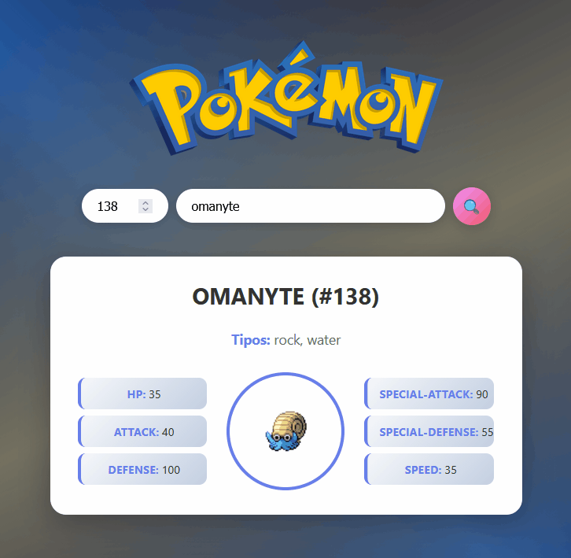

# 🐾 APIs Divertidas de Animales

Proyecto educativo que muestra diferentes implementaciones de APIs de animales, desde una versión básica hasta versiones profesionales con información detallada.

## 📁 Estructura del Proyecto

```
20260527-APIs-divertidas/
├── 01-TheDogAPI/           # Versión básica (Dog CEO API)
├── 02-TheDogAPI-Pro/       # Versión mejorada (TheDogAPI)
├── 03-TheCatAPI-Pro/       # Versión felina (TheCatAPI)
├── 04-pokeAPI/             # Otra API divertida con imágenes y sonidos de pokémon.
└── README.md               # Este archivo
```

## 🐕 01-TheDogAPI (Versión Básica)

**API utilizada:** [Dog CEO](https://dog.ceo/dog-api/)

---

## 🦴 02-TheDogAPI-Pro (Versión Mejorada)

**API utilizada:** [TheDogAPI](https://api.thedogapi.com/)

---

## 🐱 03-TheCatAPI-Pro (Versión Felina)

**API utilizada:** [TheCatAPI](https://api.thecatapi.com/)

## Ϟ(๑⚈ ․̫ ⚈๑)⋆ 04-pokeAPI (con sonidos y efectos CSS dinámicos)

**API utilizada:** [pokeAPI](https://pokeapi.co/api/v2/)



---

## 🔑 API Keys

**Nota importante:** Las API Keys incluidas en el código son de ejemplo. Para producción, deberías:

1. Registrarte en [TheDogAPI](https://api.thedogapi.com/) y [TheCatAPI](https://api.thecatapi.com/)
2. Obtener tus propias API Keys gratuitas
3. Reemplazar las keys en los archivos JavaScript

### Variables a modificar:
- `02-TheDogAPI-Pro/perro.js`: `const API_KEY = "tu-key-aqui";`
- `03-TheCatAPI-Pro/gato.js`: `const API_KEY = "tu-key-aqui";`

---


---

## 🛠️ Tecnologías Utilizadas

- **HTML5** - Estructura semántica
- **CSS3** - Estilos modernos con gradients, flexbox, grid
- **JavaScript (ES6+)** - Async/await, fetch API, módulos
- **APIs externas** - Dog CEO, TheDogAPI, TheCatAPI

---


## 📄 Licencia

Proyecto creado con fines educativos. Las APIs utilizadas tienen sus propios términos de servicio.

---

**¡Disfruta explorando el mundo de las APIs! 🐾**