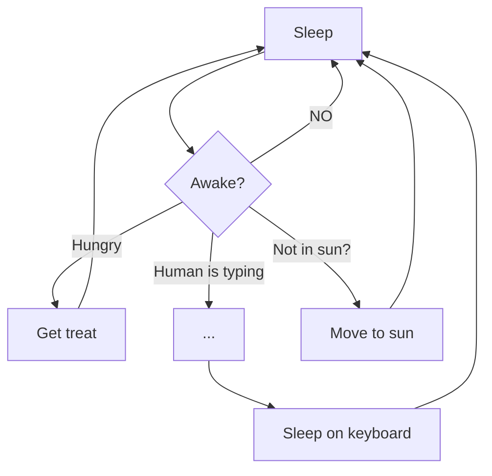

# 💻 Ejercicios Bootcamp Serprofes – Full Stack Web Development

Repositorio de ejercicios realizados durante el bootcamp **Serprofes** enfocado en **FRONT-END & BACK-END WEB DEVELOPMENT**.

## 🚀 Tecnologías trabajadas
- HTML5
- CSS3 (Flexbox & Grid)
- JavaScript
- Node.js (en progreso)

Este repositorio contiene prácticas, retos y pequeños proyectos diseñados para reforzar conceptos clave del desarrollo web moderno, tanto en cliente como en servidor.

---

## 📂 Contenido
Aquí encontrarás:
- Ejercicios básicos y avanzados de maquetación
- Prácticas interactivas con JavaScript
- Retos de lógica de programación
- Próximamente: proyectos y ejercicios con Node.js 🚀

---

## 📌 Recursos útiles
- https://thumbnail.ws/ → Captura la portada de tu web  
- https://flexboxfroggy.com/#es → Practica Flexbox jugando  
- https://cssgridgarden.com/#es → Practica CSS Grid jugando  
- https://excalidraw.com/ → Pizarra online para esquemas  
- https://miro.com → Diagramas de flujo  

---

📜 Contenido anterior del README

### Recursos gráficos trenes...  

- https://www.freepik.com/vectors/train-side-view  
- https://www.vecteezy.com/free-vector/train-side-view

